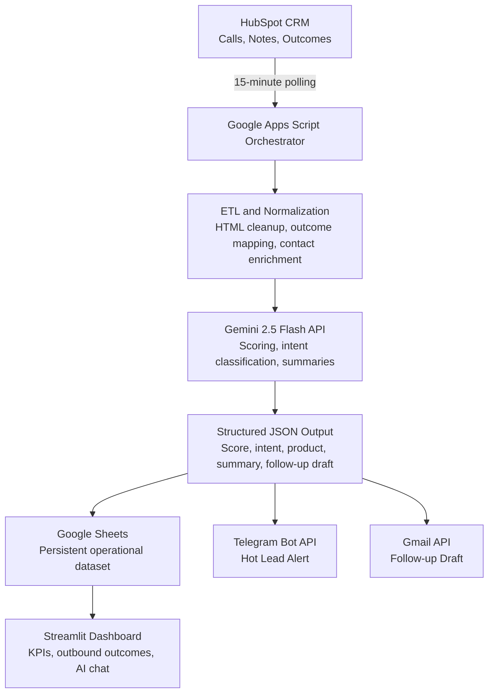

# Automated Lead Qualification and Outreach Pipeline

An end-to-end automation pipeline for mortgage broker call qualification, AI scoring, real-time alerts, follow-up drafting, and business intelligence reporting.

---

## Project Overview

This project automates the full operational flow from HubSpot call records to actionable sales follow-up.

The pipeline ingests call data, normalizes notes, scores and classifies leads with Gemini, stores structured outputs in Google Sheets, sends hot-lead alerts via Telegram, and creates Gmail follow-up drafts for qualified opportunities.

A Streamlit dashboard provides KPI tracking, outbound call outcome analysis, and a conversational AI interface for natural language queries.

---

## Business Problem

High-volume mortgage sales teams need a repeatable way to process and prioritize broker calls.

Manual handling causes:

- Delayed qualification of high-intent opportunities
- Inconsistent lead scoring and follow-up decisions
- Slow manager visibility for urgent leads
- Limited analytics for product demand, agent performance, and call outcomes

This solution standardizes and accelerates the process with AI-assisted scoring and automated workflow orchestration.

---

## Architecture

The pipeline operates in three integrated layers:

1. Data Ingestion and Processing Layer
2. Intelligence and Automation Layer
3. Analytics and Decision Layer

---

## Project Diagram (Mermaid)



---

## Methodology

### Phase 1: Data Ingestion and ETL

Trigger: Time-based scheduler (every 15 minutes).

- API Poll: Query HubSpot engagements/calls endpoint for new records since last poll.
- Field Extraction:
  - hs_call_body (agent notes)
  - hs_call_outcome (call result: Connected, Busy, No Answer, etc.)
  - hubspot_owner_id (agent who took the call)
  - hs_timestamp (call date/time)
- Data Normalization:
  - Remove HTML tags and special characters
  - Map HubSpot outcome UUIDs to readable strings
  - Fetch associated contact details (name, email, phone)
  - Apply title case formatting for consistency
- Deduplication: Check against stored engagement IDs to prevent double-processing.
- Output: Normalized lead object passed to AI scoring.

### Phase 2: AI Scoring and Intelligence

Model: Gemini 2.5 Flash.

System prompt design positions the model as a Non-QM mortgage expert for product identification, semantic intent analysis, and follow-up support.

Scoring logic:

- 80-100 (Hot): Ready to transact, multiple clients mentioned, explicit product request
- 60-79 (High): Clear interest, specific product fit, near-term pipeline
- 30-59 (Medium): General interest, comparing options, slow pipeline
- 0-29 (Low): No volume, conventional-only borrowers, declined partnership

Output: JSON response with structured fields for downstream automation.

### Phase 3: Real-Time Alerting and Outreach

#### 3a. Hot Lead Detection

- If interest_score >= 80, trigger Telegram alert.
- Message includes contact name, phone, agent name, product, score, state, and AI summary.
- Target delivery: under 2 seconds.

#### 3b. Email Automation

- If interest_score >= 40, generate follow-up email.
- AI-drafted body personalizes:
  - Broker name (mail merge from call notes)
  - Agent name (who took the call)
  - Product type (detected from conversation)
  - Next steps (based on AI analysis)
- Two modes:
  - Draft Mode (Current): Email saved as draft in Gmail for review
  - Auto-Send Mode (Future): Direct transmission after manager approval

#### 3c. Data Persistence

All records are appended to Google Sheets, including:

- id_llamada (engagement ID, prevents duplicates)
- fecha_registro (call date)
- nombre_broker (contact name)
- email_broker (contact email)
- nota_original (raw call notes)
- interest_score (AI score 0-100)
- intent_level (Hot/High/Medium/Low)
- product_detectado (DSCR, ITIN, Foreign National, etc.)
- resumen_markdown (executive summary)
- cuerpo_email_generado (email draft)
- status_seguimiento (Pending/Sent/Draft/Error)

### Phase 4: Analytics and Visualization

Dashboard layer: Streamlit (Python).

KPI Dashboard:

- Lead conversion funnel (calls -> qualified -> hot)
- Interest score distribution histogram
- Product demand pie chart
- Geographic heatmap (state-level analysis)
- Outbound Calls by Outcome chart (Busy, Connected, No Answer, Wrong Number)

Agent Performance:

- Average score per agent
- Email sent/draft count
- Product specialization analysis

Market Insights:

- Product trends over time
- Seasonal demand patterns
- Broker engagement metrics

AI Chat Interface:

- Semantic search over lead database
- Natural language queries (example: Show me all DSCR leads in Texas)
- Conversational AI powered by Gemini

---

## Skills and Tools Applied

| Category | Tool/Framework | Purpose |
|---|---|---|
| CRM Integration | HubSpot API (REST) | Source system for call records |
| Orchestration | Google Apps Script (JavaScript) | ETL, workflow automation, middleware |
| AI/ML | Gemini 2.5 Flash API | Lead scoring, NLP, text generation |
| Email Automation | Gmail API | Draft/send follow-up emails |
| Real-Time Alerts | Telegram Bot API | Instant notifications for hot leads |
| Database | Google Sheets (via gspread) | Central repository, analytics source |
| Dashboard | Streamlit (Python) | Interactive KPI visualization |
| Data Processing | pandas, plotly | Data manipulation, charting |
| Authentication | OAuth 2.0, API Keys | Secure credential management |
| Error Handling | Logging, try-catch | Pipeline resilience |

### Technical Architecture Highlights

- Prompt Engineering: Specialized prompts guide Gemini to classify Non-QM products with high consistency
- JSON Schema Enforcement: Structured output prevents mapping and parsing errors
- Deduplication Logic: Engagement ID tracking prevents reprocessing
- Timezone Handling: Supports Mazatlan timezone (GMT-7) for operational timestamp consistency
- Mail Merge Templates: Dynamic placeholder replacement for personalized outreach
- API Rate Control: Configurable polling intervals and request pacing to respect quotas

---

## System Components

### A. Google Apps Script Modules

| File | Function | Responsibility |
|---|---|---|
| Main.gs | runPipeline() | Orchestrates all phases in sequence |
| Config.gs | CONFIG object | Centralized credential manager |
| HubSpotETL.gs | fetchNewCallNotes() | Polls HubSpot API and normalizes call data |
| GeminiAI.gs | scoreLeadWithGemini() | Sends notes to Gemini and parses JSON response |
| GmailOutreach.gs | sendFollowUpEmail() | Composes and sends/saves follow-up drafts |
| Notifications.gs | notifyIfHotLead() | Triggers Telegram alerts for urgent leads |
| SheetsDB.gs | appendLeadRow() | Persists structured records to Google Sheets |

### B. Python Dashboard

| File | Purpose |
|---|---|
| app.py | Main Streamlit app with KPI, performance, explorer, and AI chat tabs |
| data_loader.py | Google Sheets connector, schema mapping, KPI computation |
| ai_chat.py | Gemini integration for conversational analytics |
| requirements.txt | Python dependencies |

---

## Setup and Configuration

### Prerequisites

- HubSpot Private App access token
- Gemini API key
- Google Sheet ID
- Telegram bot token and chat ID
- Python 3.9+ runtime

### Apps Script Configuration

Required Script Properties:

- HUBSPOT_ACCESS_TOKEN
- GEMINI_API_KEY
- SPREADSHEET_ID
- TELEGRAM_BOT_TOKEN
- TELEGRAM_CHAT_ID

Optional Script Properties:

- POLL_INTERVAL_MINUTES
- HOT_LEAD_THRESHOLD
- GMAIL_DRAFT_MODE
- HUBSPOT_OWNER_EMAIL

Initial one-time setup:

```javascript
validateSetup();
setupSpreadsheet();
installTrigger();
```

### Dashboard Configuration

Install dependencies:

```bash
cd dashboard
pip install -r requirements.txt
```

Set environment variables in dashboard/.env:

```env
SPREADSHEET_ID=your_sheet_id
GEMINI_API_KEY=your_gemini_key
GOOGLE_SERVICE_ACCOUNT_JSON={...}
```

Run dashboard:

```bash
cd dashboard
streamlit run app.py
```

---

## Security and Data Governance

- Credentials are managed via Apps Script Script Properties and dashboard environment variables.
- Pipeline communication uses authenticated API calls across controlled services.
- Access to spreadsheet data and execution contexts is permission-based.

### Confidentiality Statement

Data processed through this API-based workflow is not used to train public Google models.

This guarantees confidentiality for brokers and their clients while enabling secure AI-driven lead scoring, summaries, and outreach draft generation.

---

## Results

This pipeline delivers:

- Faster identification of high-intent leads
- More consistent and auditable scoring decisions
- Immediate manager visibility through real-time alerting
- Higher follow-up consistency through AI-generated drafts
- Centralized call tracking and analytics in one dashboard

---

## Live Demo Links

Add your public links here before publishing:

- Dashboard URL: `https://your-dashboard-url.streamlit.app`
- Demo Video (Google Drive): `https://drive.google.com/file/d/your-video-id/view`

Recommended note for reviewers:

"If the dashboard is sleeping (free hosting), please wait a few seconds for startup."

---

## License

MIT
